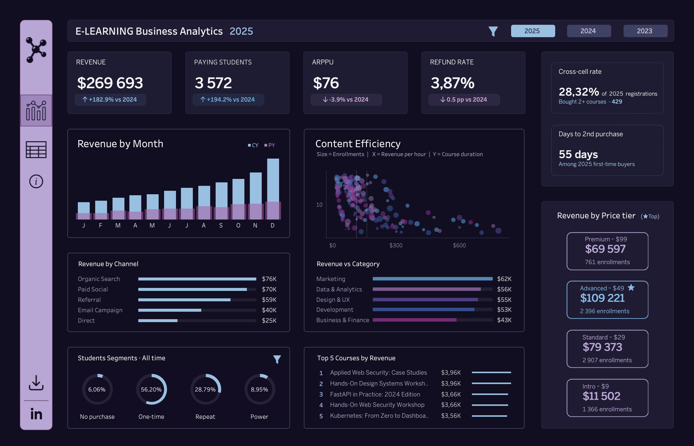
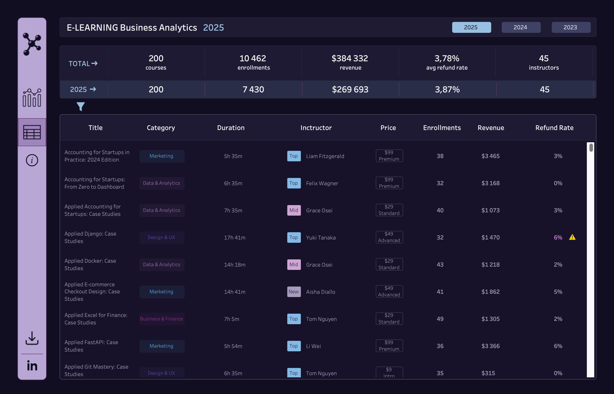

# E-Learning Business Analytics

This interactive Tableau dashboard is analyzing the performance of a fictional online learning platform.
The project combines business KPIs, student behavior, acquisition performance and course-level insights in one report to support data-driven decisions.

[You can explore the interactive Tableau dashboard here](https://public.tableau.com/app/profile/alesia.alieva/viz/E-LearningBusinessAnalytics/DashboardOverview).

<p align="center">
  
  
</p>

⚠️ The dataset used in this project is synthetic and was generated with **Claude AI** for portfolio purposes.

## Data Pipeline
The dashboard was built through a structured analytics workflow:  

[Claude AI] → raw CSVs → [Python + DuckDB] → quality checks → staging → marts → [Tableau]  

1. **Synthetic Data Generation**
   
   Raw source data was generated with Claude AI.

3. **Raw Data Layer**
   
   Multiple source tables were stored as raw CSV files:

    | Table | Description | Key Fields |
    |------|-------------|------------|
    | students | Student registration and profile data | student_id, reg_date, country, acquisition_channel |
    | courses | Course catalog information | course_id, title, category, instructor_id, price, duration_hours |
    | enrollments | Student course purchases | enrollment_id,	student_id,	course_id,	enroll_date,	completion_pct |
    | payments | Payment and refund transactions | payment_id,	student_id,	course_id,	amount,	status,	date |
    | instructors | Instructor details | instructor_id, instructor_name, tier, subject_area |


3. **Data Processing (Python + DuckDB)**

   All data preparation was completed in Jupyter Notebook using Python + DuckDB.
   SQL queries were executed in DuckDB for cleaning, joins, transformations and metric preparation.
   
   Each stage generated new CSV tables that were used as inputs for the next step:
    ```
    ├── data/
       ├── raw/
       │   ├── courses.csv
       │   ├── enrollments.csv
       │   ├── students.csv
       │   ├── instructors.csv
       │   └── payments.csv
       ├── staging/
       │   ├── stg_courses.csv
       │   ├── stg_enrollments.csv
       │   ├── stg_students.csv
       │   ├── stg_instructors.csv
       │   └── stg_payments.csv
       └── marts/
           ├── mart_enrollments_detail.csv
           ├── mart_dim_courses.csv
           └── mart_dim_students.csv
    ```
- **Quality Checks**
  
  Validation steps included null checks, duplicates review and business logic controls.

  Examples:
  ```sql
  
  --Check required fields for NULL values.
  SELECT
    COUNT(*) AS total_rows,
    SUM(CASE WHEN payment_id IS NULL THEN 1 ELSE 0 END) AS null_payment_id,
    SUM(CASE WHEN student_id IS NULL THEN 1 ELSE 0 END) AS null_student_id,
    
    -- course_id ALWAYS must be filled in
    SUM(CASE WHEN course_id  IS NULL OR course_id = '' THEN 1 ELSE 0 END) AS null_course_id,
    SUM(CASE WHEN amount     IS NULL THEN 1 ELSE 0 END) AS null_amount,
    SUM(CASE WHEN status     IS NULL THEN 1 ELSE 0 END) AS null_status,
    SUM(CASE WHEN date       IS NULL THEN 1 ELSE 0 END) AS null_date
  FROM payments
  ```

  ```python
  # Checking primary keys for duplicates
  
  pk_checks = [
    ('students',    'student_id'),
    ('courses',     'course_id'),
    ('instructors', 'instructor_id'),
    ('enrollments', 'enrollment_id'),
    ('payments',    'payment_id'),
    ]

  for table, pk in pk_checks:
    path = TABLES[table]
    result = con.sql(f"""
        SELECT COUNT(*) - COUNT(DISTINCT {pk}) AS duplicate_pks
        FROM '{path}'
     """).df()
    val = result.iloc[0, 0]
    print(f'   {table}.{pk} — duplicates: {val}')
  ```
    See all examples in [data_processing/1_Quality_checks_examples.ipynb](data_processing/1_Quality_checks_examples.ipynb)


- **Staging Layer**
  
  Cleaned and standardized intermediate tables were created for further transformations.
 
  Examples:
  ```sql
  --Added price_tier - a helper category.

  SELECT
    course_id,
    TRIM(title)                          AS title,
    TRIM(category)                       AS category,
    instructor_id,
    CAST(price AS DECIMAL(10,2))         AS price,
    CAST(duration_hours AS DECIMAL(6,1)) AS duration_hours,
    CASE
        WHEN CAST(price AS INTEGER) <=  9 THEN 'intro'     -- $9
        WHEN CAST(price AS INTEGER) <= 29 THEN 'standard'  -- $29
        WHEN CAST(price AS INTEGER) <= 49 THEN 'advanced'  -- $49
        ELSE                                   'premium'   -- $99
    END                                  AS price_tier

  FROM courses
  WHERE course_id IS NOT NULL
    AND CAST(price AS FLOAT) > 0
    AND CAST(duration_hours AS FLOAT) > 0
  ```
    See all examples in [data_processing/2_Staging_examples.ipynb](data_processing/2_Staging_examples.ipynb)

- **Data Marts**
  
  Final analytical tables were built for KPI calculations, segmentation, retention.
  
  Examples:
  ```sql
  WITH

  -- ─────────────── Aggregate all payments at the student level ──────────────────────
  student_payments AS (
    SELECT
        student_id,
        
        -- Count of successful payment transactions
        SUM(CAST(is_success  AS INTEGER))                           AS successful_payments,

        -- Unique purchased courses (successful payments only)
        COUNT(DISTINCT CASE WHEN is_success THEN course_id END)     AS courses_purchased,

        -- Timeline of when the student was active
        MIN(CASE WHEN is_success THEN payment_date END)             AS first_payment_date,
        MAX(CASE WHEN is_success THEN payment_date END)             AS last_payment_date,
        DATEDIFF('day',
            MIN(CASE WHEN is_success THEN payment_date END),
            MAX(CASE WHEN is_success THEN payment_date END)
        )                                                           AS days_active

    FROM stg_payments
    GROUP BY student_id
  ),

  -- ─────────────── Calculate days to the second purchase ──────────────────────
  -- Cross-sell metric: how quickly a one-time buyer returns
  purchase_sequence AS (
    SELECT
        student_id,
        payment_date,
        ROW_NUMBER() OVER (
            PARTITION BY student_id
            ORDER BY payment_date
        ) AS purchase_num
    FROM stg_payments
    WHERE is_success = TRUE
  ),

  days_to_second AS (
    SELECT
        first_buy.student_id,
        DATEDIFF('day',
            first_buy.payment_date,
            second_buy.payment_date
        ) AS days_to_second_purchase
    FROM purchase_sequence first_buy
    LEFT JOIN purchase_sequence second_buy
           ON first_buy.student_id  = second_buy.student_id
          AND second_buy.purchase_num = 2
    WHERE first_buy.purchase_num = 1
  )

  -- ─────────────── Final table: student + payment summary ──────────────────────
  SELECT
    s.student_id,
    s.reg_date,
    s.cohort_month,
    s.reg_year,
    s.country,
    s.acquisition_channel,

    
    COALESCE(p.courses_purchased,   0) AS courses_purchased,
    p.first_payment_date,
    p.last_payment_date,
    COALESCE(p.days_active, 0)         AS days_active,
    d.days_to_second_purchase,

    -- Segmentation by purchase behavior (no_purchase < one_time < repeat < power)
    CASE
        WHEN COALESCE(p.successful_payments, 0) = 0 THEN 'no_purchase'
        WHEN COALESCE(p.courses_purchased,   0) = 1 THEN 'one_time'
        WHEN COALESCE(p.courses_purchased,   0) <= 4 THEN 'repeat'
        ELSE                                              'power'
    END AS student_segment

  FROM stg_students s
  LEFT JOIN student_payments p  ON s.student_id = p.student_id
  LEFT JOIN days_to_second   d  ON s.student_id = d.student_id

  ```
      See all examples in [data_processing/3_Marts_examples.ipynb](data_processing/3_Marts_examples.ipynb)

4. **Visualization**  
   Processed marts were connected to Tableau to build the final interactive dashboard.
